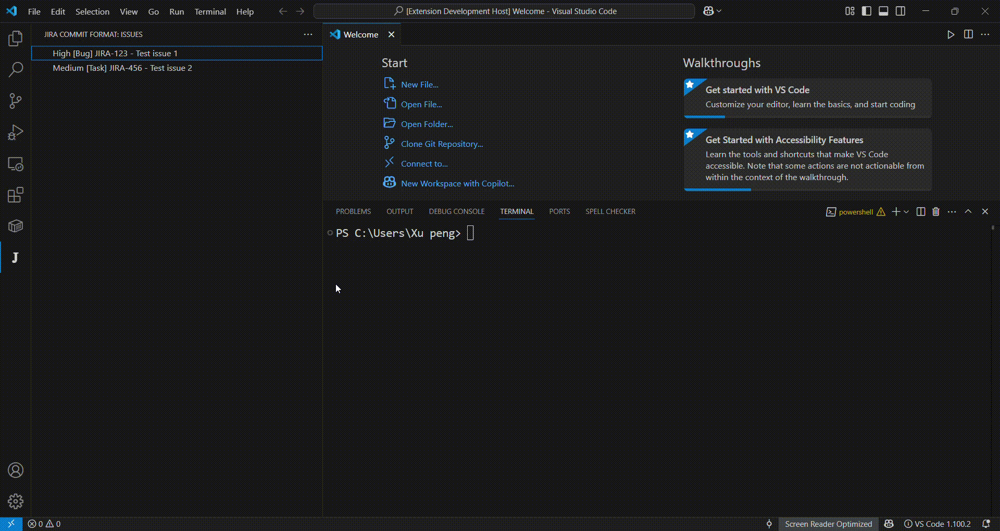

## Features
* Automatically generate jira commit message in certain format.

* Default format is: {{issue.key}} - {{issue.summary}},
* Support issue field are `key` | `summary` | `type` | `status` | `source`, 
* Support use js expression `{{issue.type == 'Bug' ? ('[BugFix] ' + issue.key): ('[Others]' + issue.key) }} - {{issue.summary}}`.
* `status` value includes `Bug` `Task` `Story`, etc..
* `source` value is the original `jira` object from JIRA api

